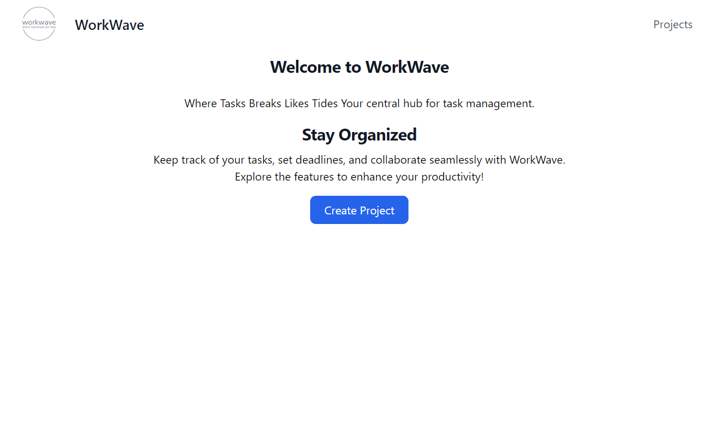
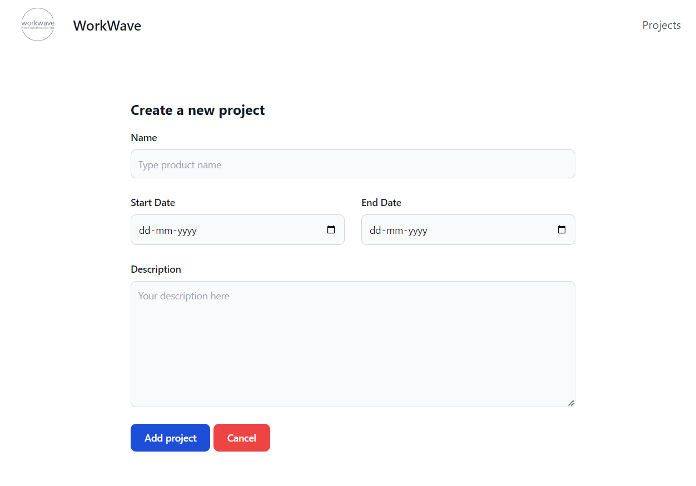

# WorkWave - Where Tasks Breaks Like Tide
 WorkWave is a Django web application for managing projects, tasks, and team collaboration.

## Features

- Project creation, update, and deletion
- Task tracking with due dates and status
- User profiles with bio and social links
- Task comments and attachments
- Project managers and team leads roles

<!-- Add a container div to hold the images -->
<div style="display: flex; justify-content: center;">
    <!-- Add the first image with appropriate styling -->
    
    <!-- Add the second image with appropriate styling -->
    
</div>


## Setup Instructions

Follow these steps to set up the WorkWave Django app:

###  Clone the Repository

```bash
git clone https://github.com/SHIV000000/WorkWave.git
```
```bash
cd WorkWave
```
**Create a Virtual Environment**

On macOS/Linux:
   ```bash

   python3 -m venv venv
   ```
Activate the Virtual Environment:
```bash
source venv/bin/activate
 ```

On Windows:
```bash
python -m venv venv
```

Activate the Virtual Environment:
```bash
.\venv\Scripts\activate
```

## Install Dependencies:

```bash
pip install django
```
```bash
python -m pip install Pillow
```
```bash
pip install -r requirements.txt
```

## Apply Migrations:

```bash
python manage.py makemigrations
```

```bash
python manage.py migrate
```
## Create Superuser (Optional)

 ```bash
python manage.py createsuperuser
```
## Run the Development Server

Start the development server using Gunicorn:

```bash
gunicorn workwave.wsgi:application
```

**Run the Development Server**

```bash
python manage.py runserver
```

Visit http://127.0.0.1:8000/ in your browser.
